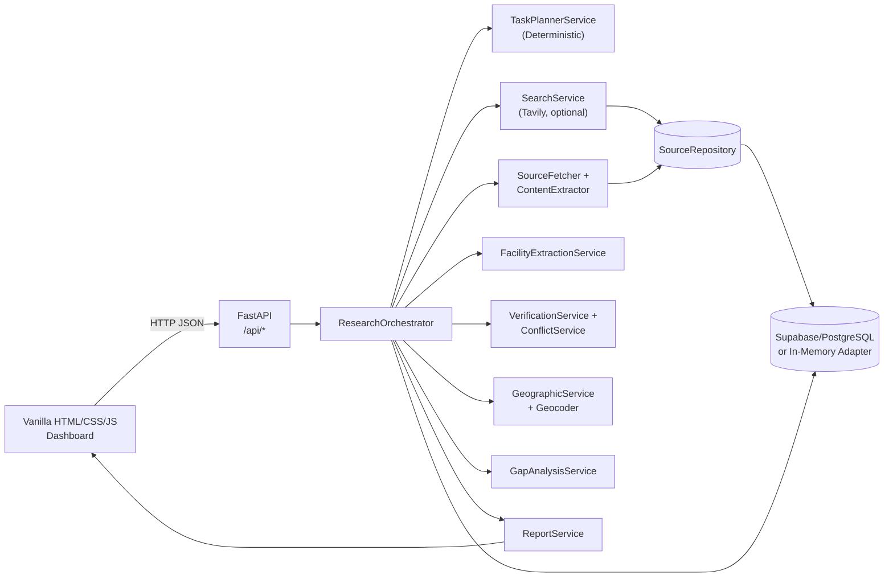

# ResearchOps — The Autonomous Healthcare Research Agent

[](https://github.com/)
[](https://github.com/)
[](https://fastapi.tiangolo.com)
[](https://python.org)
[](https://developer.mozilla.org)

> **ResearchOps** is an autonomous healthcare infrastructure research platform designed to accept natural-language queries, autonomously decompose them into discrete research sub-tasks, aggregate findings across heterogeneous public and clinical registries, detect contradictory claims, identify geographic/service accessibility gaps, and synthesize comprehensive, evidence-backed reports.

---

## 1. Team Detail

- **Project Name:** ResearchOps — The Autonomous Healthcare Research Agent
- **Team:** Spideyx
- **Event:** GATEWAYS 2026
- **Team Members:** K L Anand, Shreenivas Bhat, Ranjith C, Kushal M
- **Current Milestone:** Milestone 1 — Project Foundation & Architecture Setup

---

## 2. Problem Understanding

Healthcare access research is still mostly manual. Analysts and planners must search fragmented public sources, extract facility and service facts by hand, compare conflicting reports, and place findings on a map — then repeat the work when a new question is asked. Claims are easy to copy and hard to audit: it is often unclear which sentence, URL, or source supported a statement, and “no result found” is sometimes treated as proof that a service does not exist.

For questions such as *“Analyze cardiac healthcare infrastructure within 10 km of Whitefield and identify potential service gaps”*, the gaps are operational, not clinical:

- Public information is scattered across websites, directories, and news pages.
- Facility names, services, and locations are inconsistently described.
- Sources contradict each other; both sides of a conflict are rarely retained.
- Geographic radius and distance checks are done offline, if at all.
- There is no single, evidence-linked dossier that records limitations as well as findings.

ResearchOps is built for **healthcare infrastructure research**, not medical advice. It must not invent facilities, fabricate coordinates, or assert that a service is absent without supporting evidence.

---

## 3. Proposed Solution

ResearchOps is an **evidence-first research platform** that answers healthcare access questions with traceable, source-linked findings. A user submits a natural-language query; the system coordinates source discovery, content extraction, geographic analysis, conflict detection, and service-gap assessment, and returns a structured dossier with every claim linked to its original source.

It does **not** provide medical recommendations. Every finding is limited to retrieved evidence, and limitations are always reported alongside results.

### Capabilities

| Capability | Description |
|---|---|
| Source discovery | Searches the web via Tavily and fetches page content with safe HTTP extraction |
| Facility extraction | Identifies healthcare facilities and services from source text; links each claim to its origin sentence |
| Evidence verification | Requires ≥2 independent URLs to mark a claim `SUPPORTED`; retains both sides of any contradiction |
| Conflict detection | Flags explicit contradictions between sources and preserves them in the report |
| Geographic analysis | Parses radius/location from the query, geocodes facilities, and computes distances |
| Service-gap assessment | Provides cautious availability assessments; never asserts absence without evidence |
| Report generation | Produces a downloadable, evidence-linked research dossier |
| Zero-build dashboard | Vanilla HTML/CSS/JS frontend served directly by FastAPI — no npm install |
| Dual persistence | Supabase/PostgreSQL for production; in-memory adapter for local development |

### Tech stack

| Layer | Technology |
|---|---|
| **Backend** | Python 3.11+, FastAPI, Uvicorn, Pydantic v2 |
| **Database** | Supabase (PostgreSQL + PostgREST) · in-memory adapter for local dev |
| **Search** | Tavily API |
| **Geocoding** | Nominatim (production) · mock provider (local dev) |
| **Frontend** | Vanilla HTML/CSS/JS, Leaflet.js, Chart.js (CDN) |
| **Testing** | pytest, ruff |

---

## 4. System Architecture



The browser is served by FastAPI at `/ui/`. The API applies input validation, configured CORS, request limits, rate limits, and sanitized error handling. Planning is **deterministic** by default (no LLM call on the live path). Without `TAVILY_API_KEY`, a run is marked `unconfigured` — never a fake success.

### Request lifecycle

1. `POST /api/research` validates the query and creates a project with a unique research ID.
2. `TaskPlannerService` generates a bounded, deterministic task list (no LLM call in the default path).
3. If `TAVILY_API_KEY` is set, the search service fetches source metadata. Otherwise the run is marked `unconfigured`.
4. The source fetcher applies URL/redirect restrictions, size limits, and timeouts. Page content is untrusted input, never instructions.
5. `FacilityExtractionService` associates services to facilities only when they co-occur in the same sentence. Negation is preserved.
6. Verification requires ≥2 distinct supporting URLs for `SUPPORTED`; explicit opposition yields `CONFLICTING`.
7. Geographic analysis uses coordinates from sources or the configured geocoder. Missing coordinates are reported, never generated.
8. Service gaps are inferred from collected evidence only. The report is written to the database and returned as a structured dossier.
9. The API returns execution mode, per-stage progress, limitations, result counts, and the report ID.

### Project structure

```
.
├── backend/
│   ├── app/
│   │   ├── api/            # FastAPI routers
│   │   ├── core/           # Config, exceptions
│   │   ├── db/             # Database client + MockDatabaseClient
│   │   ├── models/         # DB-layer models
│   │   ├── repositories/   # Repository pattern (project, task, report, entities)
│   │   ├── schemas/        # Pydantic request/response schemas
│   │   ├── services/       # Orchestrator, planner, search, extraction, geo, gaps, report, verification
│   │   └── utils/          # Logger
│   ├── migrations/         # SQL migrations 001–005
│   ├── tests/              # pytest suite (unit + E2E)
│   ├── pyproject.toml      # ruff config
│   └── requirements.txt
├── frontend/
│   ├── index.html          # No-build dashboard
│   ├── css/style.css
│   └── js/app.js
├── docs/
│   ├── api.md
│   ├── architecture.md
│   ├── demo.md
│   ├── deployment.md
│   └── setup.md
├── scripts/
│   └── run_dev.py          # Dev runner
├── .env.example
└── README.md
```

### Quick start

**Prerequisites:** Python 3.11+, pip, a modern browser. Optional: [Tavily API key](https://tavily.com/) for live research; [Supabase project](https://supabase.com/) for durable storage.

```bash
git clone <repo-url>
cd <repo-root>

python -m venv .venv
# Windows PowerShell:
.\.venv\Scripts\Activate.ps1
# macOS / Linux:
source .venv/bin/activate

python -m pip install --upgrade pip
python -m pip install -r backend/requirements.txt

# Windows PowerShell:
Copy-Item .env.example .env
# macOS / Linux:
cp .env.example .env

python scripts/run_dev.py
```

Open **<http://127.0.0.1:8000/ui/>** — confirm the header reads **API connected**, then submit a research question. **Never put secrets in `frontend/`.**

> **Without a Tavily key** the run completes as `unconfigured` (zero sources, skipped search/extraction). This is correct behaviour and not a bug.

**Development:** `python scripts/run_dev.py` (hot-reload).

**Production (single worker, no reload):**

```bash
python -m uvicorn backend.app.main:app --host 0.0.0.0 --port 8000 --workers 1
```

Use exactly **one** worker. Rate limiting, project/report lookup, and several registries are process-local.

| URL | Description |
|---|---|
| `http://127.0.0.1:8000/ui/` | Dashboard |
| `http://127.0.0.1:8000/docs` | Swagger UI |
| `http://127.0.0.1:8000/redoc` | ReDoc |
| `http://127.0.0.1:8000/api/health` | Liveness check |
| `http://127.0.0.1:8000/api/health/database` | Database connectivity |

### Environment variables

| Variable | Default | Description |
|---|---|---|
| `ENVIRONMENT` | `development` | Set `production` to enable fail-fast production checks |
| `DEBUG` | `true` | Enables hot-reload; **must be `false` in production** |
| `PROJECT_NAME` / `VERSION` | — | API metadata strings |
| `API_HOST` / `API_PORT` | `127.0.0.1` / `8000` | Local bind address and port |
| `ALLOWED_ORIGINS` | localhost variants | Comma-separated exact browser origins. Wildcards are rejected |
| `TAVILY_API_KEY` | *(empty)* | **Required in production.** Enables live web search |
| `SUPABASE_URL` | *(empty)* | **Required in production.** Supabase project URL |
| `SUPABASE_SERVICE_ROLE_KEY` | *(empty)* | **Required in production.** Backend-only service-role key — never expose to the browser |
| `SUPABASE_SCHEMA` | `public` | Database schema name |
| `GEOCODING_PROVIDER` | `mock` | `mock` for local dev; **`nominatim` required in production** |
| `SEARCH_TIMEOUT_SECONDS` | `15` | Provider request timeout (0–60 s) |
| `SEARCH_MAX_RESULTS` | `10` | Results per search (1–20) |
| `SOURCE_FETCH_TIMEOUT_SECONDS` | `15` | Page fetch timeout (0–60 s) |
| `MAX_SOURCE_CONTENT_CHARS` | `12000` | Max extracted page text (1–100 000 chars) |
| `RESEARCH_RATE_LIMIT_PER_MINUTE` | `20` | Per-process request cap (1–600) |

> `DATABASE_URL`, `SUPABASE_ANON_KEY`, and LLM keys are **not** consumed by this application.

### Database setup (Supabase)

Without Supabase credentials the app uses an **in-memory adapter** — records are lost on process exit and `persistence_status` reports `mock_memory`. This is fine for local development only.

For durable storage:

1. Create a Supabase project.
2. In the Supabase SQL editor, execute migration files **`001` → `005`** in numeric order (found in `backend/migrations/`).
3. Set `SUPABASE_URL`, `SUPABASE_SERVICE_ROLE_KEY`, and `SUPABASE_SCHEMA` in your backend environment.
4. Verify with `GET /api/health/database` and check that a research run reports `persistence_status: database`.

Apply least-privilege grants and review Row Level Security for your project. The migrations create schema objects but do not define a deployment-specific authorization policy.

### API reference

Full documentation lives in [`docs/api.md`](docs/api.md) and the interactive Swagger UI at `/docs`.

```
POST   /api/research                           # Submit a research query
GET    /api/research/{id}                      # Project status
GET    /api/research/{id}/report               # Full evidence-linked report
GET    /api/research/{id}/geographic-analysis  # Map-ready facility distances
GET    /api/health                             # Liveness
GET    /api/health/database                    # DB connectivity
GET    /api/sources                            # Source registry
GET    /api/facilities                         # Facility registry
GET    /api/analysis/conflicts                 # Detected conflicts
GET    /api/analysis/gaps                      # Service-gap assessments
```

```bash
curl -X POST http://127.0.0.1:8000/api/research \
  -H "Content-Type: application/json" \
  -d '{
    "query": "Analyze cardiac healthcare infrastructure within 10 km of Whitefield and identify potential service gaps.",
    "parameters": {"max_tasks": 5}
  }'
```

| Status | Code | Meaning |
|---|---|---|
| `422` | `VALIDATION_ERROR` | Invalid/missing fields |
| `404` | `HTTP_404` | Project/report not in process memory |
| `429` | — | Rate limit reached; includes `Retry-After` header |
| `413` | `PAYLOAD_TOO_LARGE` | Request body > 1 MB |
| `500` | `INTERNAL_SERVER_ERROR` | Sanitized unexpected failure |

### Testing

```bash
python -m ruff check --config backend/pyproject.toml backend scripts
python -m pytest backend/tests -q
python -m pytest backend/tests/test_pipeline_e2e.py -q
```

The end-to-end test uses explicitly labelled **synthetic** adapters (marked `mock`). It validates stage flow, source traceability, conflict retention, geographic calculations, and in-memory persistence — **not** live provider or production database connectivity.

### Deployment

See [`docs/deployment.md`](docs/deployment.md) for the full checklist. Essential points:

- Serve behind **HTTPS** and a TLS-terminating reverse proxy.
- Set `ENVIRONMENT=production` and `DEBUG=false`.
- Provide `SUPABASE_URL`, `SUPABASE_SERVICE_ROLE_KEY`, `TAVILY_API_KEY`, and `GEOCODING_PROVIDER=nominatim` via your platform's secret manager — **not** a committed `.env`.
- Use **one process/replica** (state is process-local).
- Do not expose the API directly to the public internet without an authenticated gateway.

```env
ENVIRONMENT=production
DEBUG=false
SUPABASE_URL=https://<project>.supabase.co
SUPABASE_SERVICE_ROLE_KEY=<server-side key>
TAVILY_API_KEY=<provider key>
GEOCODING_PROVIDER=nominatim
ALLOWED_ORIGINS=https://<your-demo-host>
```

### Known limitations

- **No built-in authentication.** Do not expose to the public internet.
- **Process-local state.** Rate limits, project/report lookup, and registries are lost on restart. DB-backed recovery is not yet implemented.
- **Single-replica only.** Multiple workers produce inconsistent lookups and per-worker limits.
- **LLM planning not wired.** The LLM modules exist but are not connected to the default orchestrator path.
- **Health is liveness-only.** There is no dependency readiness endpoint.
- **In-memory adapter is not durable.** Records disappear on process exit; never use in production.

Further reading: [setup](docs/setup.md) · [API](docs/api.md) · [architecture](docs/architecture.md) · [demo](docs/demo.md) · [deployment](docs/deployment.md)

---

## 5. Conclusion

Milestone 1 delivered the **project foundation and architecture**: a FastAPI backend, zero-build dashboard, deterministic research pipeline, optional Tavily search, safe source extraction, verification and conflict handling, geographic and gap analysis, evidence-linked reports, and dual persistence (in-memory for local work, Supabase/PostgreSQL for durable storage).

ResearchOps lets a user ask a healthcare-infrastructure question and receive a structured, source-linked dossier with explicit limitations — without medical recommendations or fabricated evidence. Remaining work documented in this repository includes authentication, durable API recovery after restart, multi-replica operation, and connecting LLM planning only after it is implemented and tested.

> ResearchOps · Evidence-limited healthcare infrastructure research · Team Spideyx · GATEWAYS 2026
