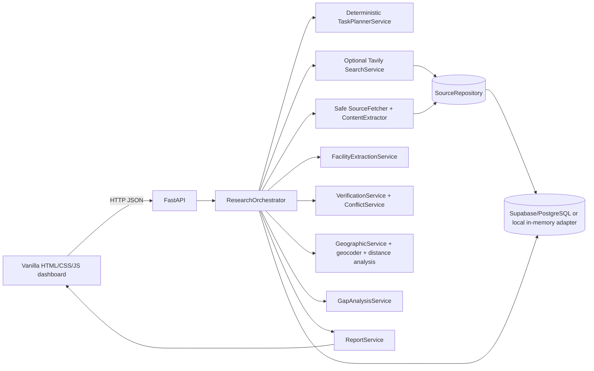

# ResearchOps architecture

## Deployed shape

The browser is served by FastAPI at `/ui/`; it has no frontend build step. Chart.js and Leaflet are loaded from their configured public CDNs, with OpenStreetMap tiles used for map backgrounds. The API applies input validation, configured CORS, request limits, rate limits, and sanitized error handling.

## Request lifecycle

1. `POST /api/research` validates the question and creates a research ID.
2. `TaskPlannerService` generates a bounded, deterministic five-phase task list. Despite the planner abstraction and prompt/LLM helper modules, the current default pipeline does not call an LLM.
3. If `TAVILY_API_KEY` is configured, the search service fetches source metadata and persists it. Otherwise search and source extraction are marked skipped; the result mode is `unconfigured`.
4. The source fetcher restricts URLs/redirects, applies size/time limits, and returns extracted text or a failure status. Webpage content is untrusted input, not instructions.
5. Facility/service extraction retains source excerpts and associates services only when they occur in the same sentence as the facility mention. Explicit availability negation is preserved.
6. Verification requires at least two distinct supporting URLs for `SUPPORTED`; explicit opposing evidence yields `CONFLICTING`; fewer independent sources remain insufficient.
7. Geographic analysis uses coordinates found in the source or a configured geocoder. Missing coordinates are reported, never generated. A radius stated as “within N km of LOCATION” is applied to that analysis.
8. Service availability and potential gaps are limited to collected evidence. The report is stored in the report service and database adapter where available.
9. The API returns the project, progress, execution mode, limitations, result counts, and report ID. The frontend fetches the report and geographic analysis and renders only those backend results.

## State and persistence

`ResearchOrchestrator` currently keeps the API's query/report lookup state in process memory. It persists project, task, source, and report records through repositories when the configured adapter is available. Without Supabase credentials, development falls back to `MockDatabaseClient`, which is in-memory and reports `persistence_status: mock_memory`; this is not durable and must not be used in production. A database outage is reported as unavailable and does not switch to mock data.

The SQL migrations define the 12 workflow tables: research projects/tasks, sources, facilities/services and associations, claims/evidence, conflicts, geographic observations, service gaps, and reports. Project-final normalized records are written through a single transactional Postgres RPC; source metadata/extraction is persisted as it is discovered. Project and report state can be reloaded from the configured database after process restart. The local adapter remains process-memory-only.

Supabase/PostgreSQL is accessed through a small database-client abstraction. Apply migrations in order before using a configured Supabase instance. Schema changes must be forward-only migrations.

## Provider configuration

| Capability | Implementation | Configuration / limitation |
|---|---|---|
| Planning | Deterministic `TaskPlannerService` | No LLM call in default pipeline |
| Search | Tavily provider | `TAVILY_API_KEY`; absent means unconfigured, not fake results |
| Extraction | Safe HTTP fetch + HTML text extraction | Public HTTP(S) sources only; unavailable pages remain unavailable |
| Geocoding | Mock provider for local development; Nominatim supported | Production requires `GEOCODING_PROVIDER=nominatim` |
| Persistence | Supabase PostgREST client or memory adapter | Production requires `SUPABASE_URL` and backend-only `SUPABASE_SERVICE_ROLE_KEY` |
| Dashboard | Vanilla browser JavaScript, Leaflet, Chart.js | No API secrets in browser; chart/map libraries use CDN assets |

## Operational limits

- The default in-memory request limiter is per process; it is not shared across replicas.
- Project and report lookup uses in-process state; a process restart loses lookup state even with a database configured. Durable API recovery/listing is not yet implemented.
- The current LLM modules are not connected to the default orchestration path. Avoid describing the app as autonomously LLM-planned until that integration is implemented and tested.
- Production deployment must use HTTPS, a restrictive CORS origin list, least-privilege database credentials and appropriate database policies, and a process manager/reverse proxy. See [deployment](deployment.md).
