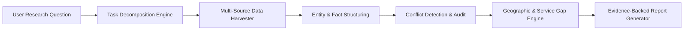
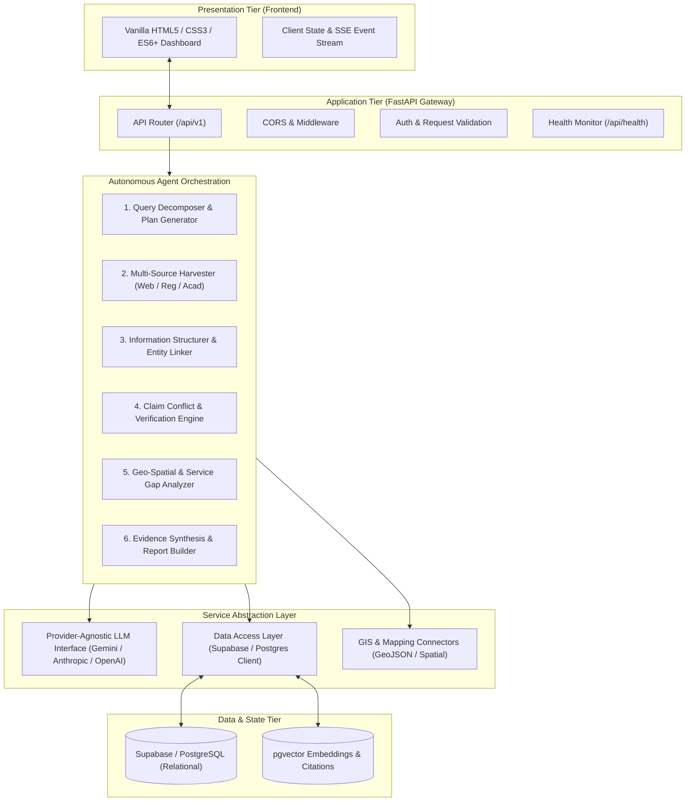

# ResearchOps Architecture & System Design

**Project:** ResearchOps — The Autonomous Healthcare Research Agent  
**Team:** Spideyx  
**Hackathon:** GATEWAYS 2026  
**Status:** Milestone 1 — Architectural Foundation  

---

## 1. System Vision & Objective

Healthcare infrastructure planning, public health resource allocation, and facility gap assessment require aggregating data across disparate, frequently conflicting sources (government reports, hospital censuses, regulatory filings, news, and academic papers). Manual synthesis is slow, prone to oversight, and difficult to audit.

**ResearchOps** is an autonomous multi-stage research agent that converts high-level natural language research questions into verifiable, structured intelligence:

---

## 2. High-Level Component Architecture

---

## 3. Autonomous Research Lifecycle

The ResearchOps agent workflow executes across six distinct stages:

### Stage 1: Query Decomposition & Hypothesis Formation
- Ingests freeform inquiries (e.g., *"Assess pediatric oncology bed shortages and travel-time disparities across southeastern Ohio."*).
- Formulates a structured research plan comprised of atomic, verifiable research tasks (facility inventory, catchment population, clinical specialties, historical closures).

### Stage 2: Multi-Source Gathering
- Parallel retrieval agents query official healthcare registries (CMS, NPI, state health departments), academic search, and verified news.
- Raw text and structured tables are ingested into transient observation buffers with immutable source metadata and timestamps.

### Stage 3: Structuring & Entity Extraction
- Extracts standardized healthcare entities: facility names, NPIs, bed capacities, trauma levels, coordinate locations, staffing metrics.
- Normalizes disparate nomenclatures into standardized healthcare taxonomy.

### Stage 4: Conflict Detection & Reconciliation
- Cross-references assertions across sources (e.g., Hospital A reported 40 ICU beds by state registry vs. 24 beds in local news after recent downsizing).
- Assigns confidence scores and flags contradictions with citation-level provenance.

### Stage 5: Geographic & Service-Gap Analysis
- Computes isochrone travel distances and catchment radius metrics around population density nodes.
- Flags maternal, pediatric, psychiatric, and trauma deserts where travel time exceeds standard emergency thresholds.

### Stage 6: Evidence-Backed Report Generation
- Synthesizes findings into an executive report with:
  - Executive summary & Key Takeaways
  - Facility & Capacity Inventory
  - Service Gap Heatmaps & Spatial Metrics
  - Resolved & Flagged Conflicts Table
  - Verifiable Footnotes & Bibliographic Citations

---

## 4. Technical Stack & Implementation Principles

### 4.1 Frontend Layer
- **Tech:** HTML5 Semantic Elements, CSS3 Custom Properties (Variables, Flexbox/Grid), Vanilla ES6+ JavaScript.
- **Design Philosophy:** Zero dependencies, lightning-fast rendering, accessible UI, and WebSocket/SSE event listener capabilities for real-time research task streaming.

### 4.2 Backend Gateway Layer
- **Tech:** Python 3.11+, FastAPI, Uvicorn, Pydantic v2.
- **Design Philosophy:** Strict schema contracts, asynchronous IO concurrency, dependency-injected services, modular routing, and resilient exception handling.

### 4.3 Database & Vector Abstraction
- **Tech:** Supabase / PostgreSQL with `pgvector`.
- **Schema Separation:**
  - `researches`: Tracks user queries, execution plans, and lifecycle states.
  - `tasks`: Individual decomposed sub-tasks.
  - `sources`: Discovered evidence artifacts with URLs, hashes, and retrieval dates.
  - `findings`: Extracted claims linked to sources.
  - `conflicts`: Detected contradictions between findings.
  - `reports`: Final markdown/JSON generated dossiers.

### 4.4 Provider-Agnostic LLM Layer
- Base class `BaseLLMService` decouples the agent logic from specific AI vendors.
- Allows seamless switching between:
  - Google Gemini (`gemini-2.5-flash`, `gemini-1.5-pro`)
  - Anthropic Claude
  - OpenAI GPT-4o
  - Local/Self-hosted models (Ollama, vLLM)
- Enforces structured JSON output via Pydantic model validation.

---

## 5. Security & Configuration Standards

1. **Zero Secret Footprint:**
   - All credentials, API keys, and sensitive database connection strings must reside exclusively in environment variables loaded via Pydantic `BaseSettings`.
   - Never commit `.env` or production credentials to source repositories.

2. **CORS & Network Isolation:**
   - Strict origin allow-lists configurable per environment (development vs. production).
   - Sanitized exception reporting preventing internal stack traces or path leaks in production responses.

3. **Data Integrity & Traceability:**
   - Every claim in generated reports must be bound to at least one primary or secondary source citation with SHA-256 content hashing.

---

## 6. Milestone 1 Verification (Current Phase)

- [x] Full directory scaffolding created.
- [x] Pydantic configuration and error handling modules initialized.
- [x] `GET /api/health` returning `{"status": "ok", "service": "researchops-api"}` implemented.
- [x] Pytest suite validating health check contract and status codes.
- [x] Interactive vanilla JS/CSS frontend connecting to health endpoint.
